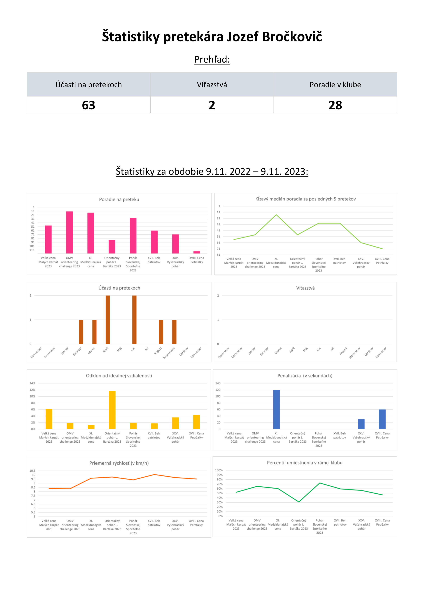

# Úvod

Tento dokument predstavuje návrh na implementáciu systému rozširujúceho aplikáciu pre administráciu činnosti športového
klubu. Obsahuje špecifikáciu vonkajších interfejsov, analýzu databázy prostredníctvom dátového modelu, použité
technológie, grafický návrh administrátorského aj používateľského rozhrania, diagramy na priblíženie funkcionalít a
interakcií systému, spracovanie
požiadaviek v kóde, mimo neho a ďalšie úpravy.

# Špecifikácia vonkajších interfejsov

Medzi vonkajšie interfejsy aplikácie patria:

- konfiguračný súbor vo formáte TOML, z ktorého produkt načítava svoje nastavenia
- konzolové rozhranie, s ktorým používateľ obsluhuje funkcie produktu
- CLI rozhranie, pomocou ktorého spúšťa funkcie produktu existujúca klubová aplikácia
- webové rozhranie existujúcej klubovej aplikácie
- súbory štatistík vo formáte HTML
- súbor SQLite databázy klubovej aplikácie
- [API SZOS](https://sandberg.orienteering.sk/api/API-dokumentacia.html)

# Návrh dátového modelu

<u>_**Dátovy model je prevzatý z existujúcej aplikácie.**_</u>

<u>_**Dátovy model je prevzatý z existujúcej aplikácie.**_</u>

# Analýza použitých technológii

- HTML, CSS, JavaScript - výstupné súbory štatistík
- PHP, SQLite - prevzaté z pôvodnej aplikácie
- Python 3.11 - primárny jazyk aplikácie
- [Chart.js](https://www.w3schools.com/js/js_graphics_chartjs.asp) - grafy v štatistikách
- pip - balíčkovanie aplikácie
- pip balíčky, na ktorých aplikácia závisí
    - [SQLAlchemy](https://docs.sqlalchemy.org/en/20/) - práca s databázou
    - [tabulate](https://pypi.org/project/tabulate/) - plaintextové tabuľky
    - [requests](https://pypi.org/project/requests/) - komunikácia s API
    - [tomli-w](https://pypi.org/project/tomli-w/) - export konfigurácie do súboru
    - [jinja](https://jinja.palletsprojects.com/en/3.0.x/) - exportovanie štatistík

# Návrh konzolového rozhrania

## Hlavné menu

```
Orienter v1.0.0 - Hlavné menu
1. Pridanie nových pretekov
2. Prihlasovanie účastníkov
3. Štatistiky
q - ukončiť

zvoľte akciu [1] >>>
```

## Pridať preteky

```
Pridanie nových pretekov > Voľba mesiaca konania
Zadajte mesiac konania pretekov.
q - návrat

mesiac konania pretekov [jun] >>>
```

## Voľba pretekov

```
Pridanie nových pretekov > Voľba mesiaca konania > Voľba pretekov
Vyberte preteky podľa ich čísel, oddelené čiarkou.
╔═══════╦════════════╦═════════════════════════════════════════════════════╦════════╦═════════════╗
║ Číslo ║ Dátum      ║ Názov                                               ║ Miesto ║ Organizátor ║
╠═══════╬════════════╬═════════════════════════════════════════════════════╬════════╬═════════════╣
║ 1.    ║ 25.05.2024 ║ Majstrovstvá Slovenska v OB v šprintových štafetách ║ Martin ║ ZMT         ║
╠═══════╬════════════╬═════════════════════════════════════════════════════╬════════╬═════════════╣
║ 2.    ║ 26.05.2024 ║ Majstrovstvá Slovenska v OB v šprintových štafetách ║ Martin ║ ZMT         ║
╚═══════╩════════════╩═════════════════════════════════════════════════════╩════════╩═════════════╝

q - návrat

preteky [vsetky] >>>
```

## Prihlasovanie

```
Prihlasovanie > Voľba pretekov
Tieto preteky sú aktívne. Vyberte tie, na ktoré chcete prihlásiť používateľov.
╔═══════╦════════════╦═════════════════════════════════════════════════════╦════════╦═════════════╗
║ Číslo ║ Dátum      ║ Názov                                               ║ Miesto ║ Organizátor ║
╠═══════╬════════════╬═════════════════════════════════════════════════════╬════════╬═════════════╣
║ 1.    ║ 25.05.2024 ║ Majstrovstvá Slovenska v OB v šprintových štafetách ║ Martin ║ ZMT         ║
╠═══════╬════════════╬═════════════════════════════════════════════════════╬════════╬═════════════╣
║ 2.    ║ 26.05.2024 ║ Majstrovstvá Slovenska v OB v šprintových štafetách ║ Martin ║ ZMT         ║
╚═══════╩════════════╩═════════════════════════════════════════════════════╩════════╩═════════════╝
q - návrat

preteky [1] >>>
```

## Voľba prihlásených pretekárov

```
Prihlasovanie > Voľba pretekov > Voľba pretekárov
Títo používatelia sa prihlásili na zvolené preteky. Vyberte tých ktorých neprihlásiť, oddeľte čiarkou.
╔═══════╦═══════════════════╦════════════╦══════════╗
║ Číslo ║ Meno a priezvisko ║ Klubové ID ║ Poznámka ║
╠═══════╬═══════════════════╬════════════╬══════════╣
║ 1.    ║ David Krchňavý    ║ id1        ║ chory    ║
╠═══════╬═══════════════════╬════════════╬══════════╣
║ 2.    ║ Ondrej Bublavý    ║ id2        ║ zdravy   ║
╚═══════╩═══════════════════╩════════════╩══════════╝

q - návrat
pretekári >>>
```

# Návrh zobrazenia štatistík

Vygenerovaný HTML dokument obsahujúci štatistiky pretekára alebo pretekárov pozostáva z dvoch sekcii. Prvá je Prehľad -
ten zobrazí akumulované informácie za celú zaznamenanú históriu pretekára v klube Sandberg. Druhá sú grafy na základe
štatistík za zvolený alebo prednastavený časový interval.

## Štatistiky jedného pretekára



## Štatistiky viacerých pretekárov

Štatistiky porovnávajúce viacerých pretekárov obsahujú jeden graf navyše, a to porovnanie časov na pretekoch za dané
čaosvé obdobie. Porovnávať časy medzi pretekmi jednoho pretekára by vzhľadom na odlišné dĺžky ich trás nemalo význam.


# Diagramy

Nasledujúci obrázok popisuje, ako komunikujú vnútorné komponenty systému pri prihlasovaní
pretekárov z klubovej aplikácie na preteky (požiadavka 3.2).


Nasledujúci obrázok obsahuje use case diagram, ktorý zobrazuje všetky činnosti,
ktoré bude vykonávať správca systému.


Nasledujúci obrázok zobrazuje komponenty systému a ich vzájomné prepojenie.
Podsystém _Communicator_ sa stará o komunikáciu s API a načítanie konfigurácie.
Podsystém _Databasor_ obsahuje ORM na prácu s databázou.
Podsystém _Statista_ obsahuje šablónu štatistík a generuje ich.
Podsystém _Commander_ zabezpečuje funkčnosť používateľského rozhrania.


# Harmonogram implementácie

1. implementovať nasledovné:
    - konfiguračný súbor aplikácie
    - databázové CRUD operácie
    - všetky API volania
    - CLI rozhranie
    - šablóna štatistík
2. otestovať všetky tieto komponenty osobitne
3. implementovať položky tieto menu a prepojiť ich s príslušnými komponentami:
    - pridávanie nových pretekov
    - prihlasovanie pretekárov na preteky
    - generovanie štatistík